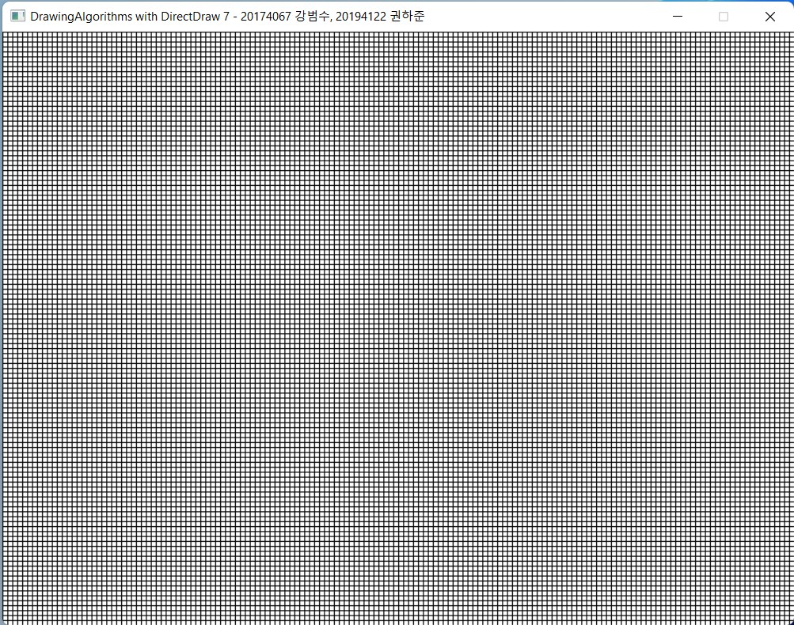
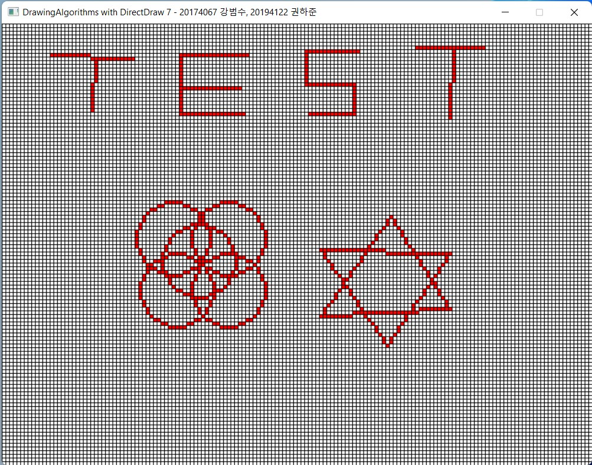
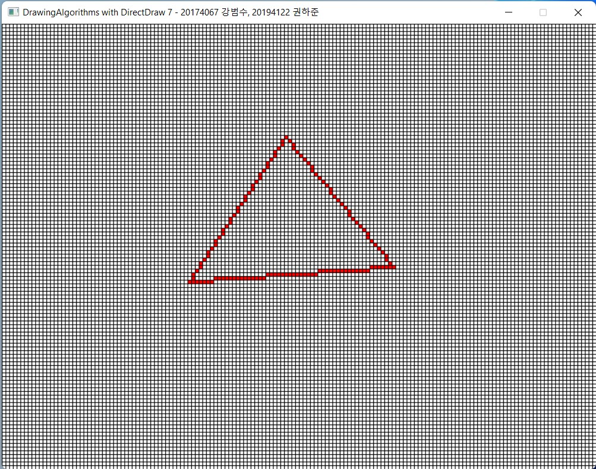
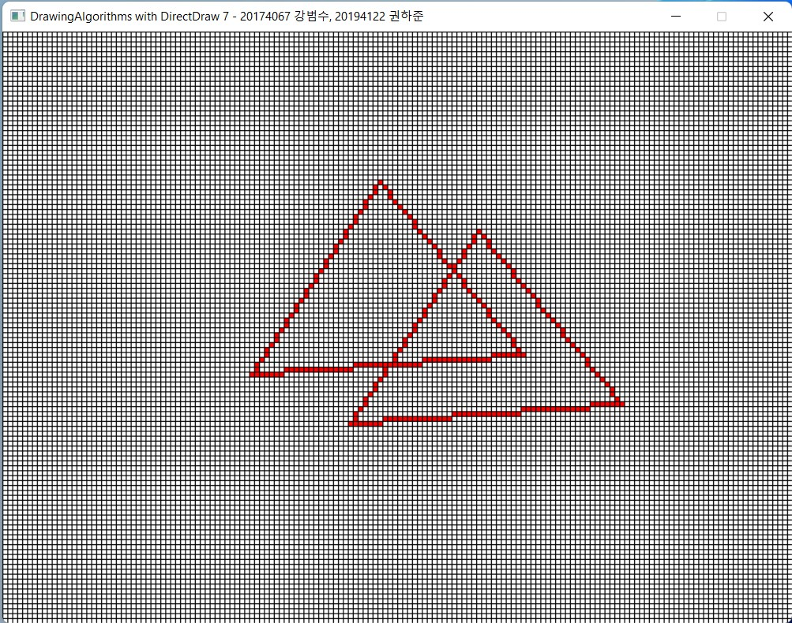
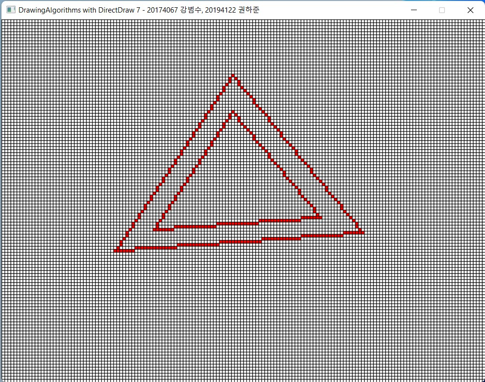
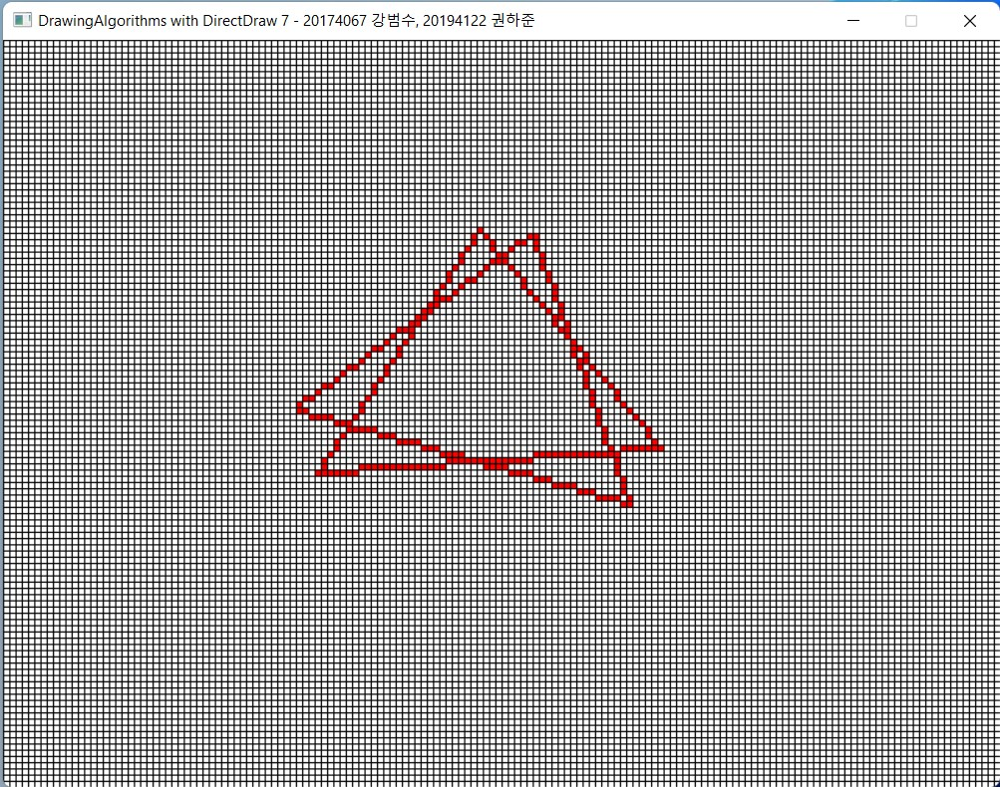
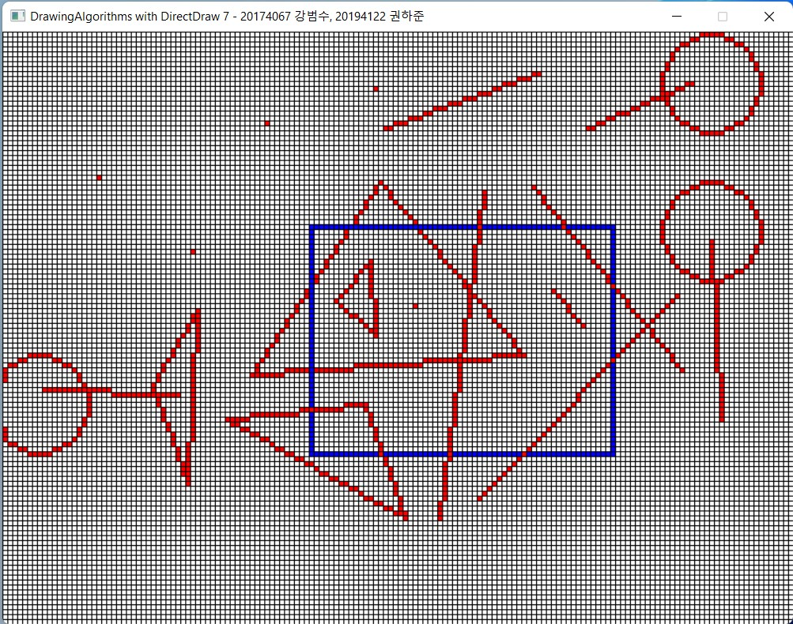
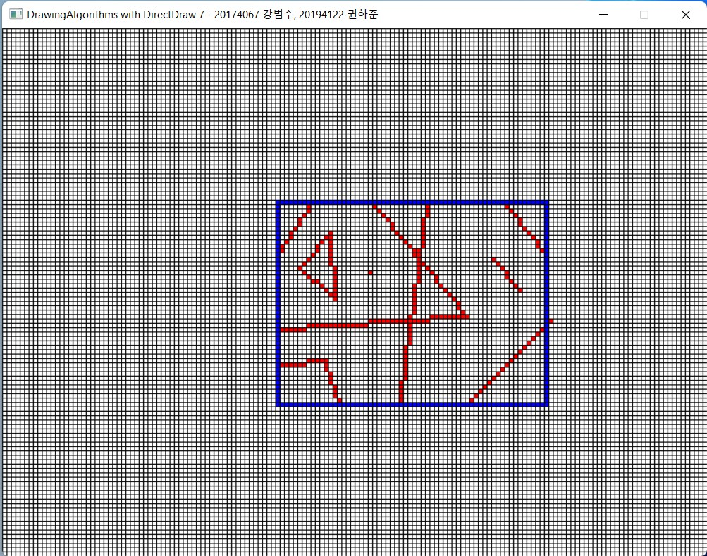

# DrawingAlgorithms

## 요구사항
Visual Studio 2019 커뮤니티, Visual Studio 2022 커뮤니티

## 컴파일 방법
Project 폴더에 DrawingAlgorithms.sln 솔루션 파일을 실행한다.

빌드 솔루션(Ctrl + Shift + B)을 한다.

F5를 눌러 실행한다.

## 실행 화면

.jpg)

## 샘플

## 변환 샘플
원본

### 이동

### 스케일링

### 회전

## 클리핑
클리핑 전

클리핑 후
